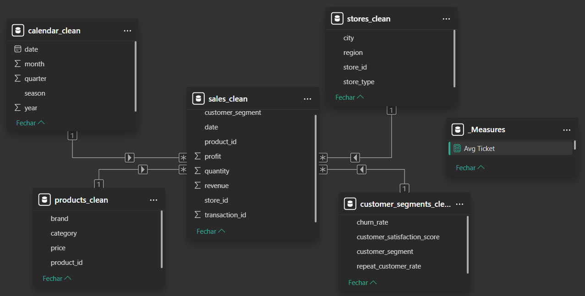
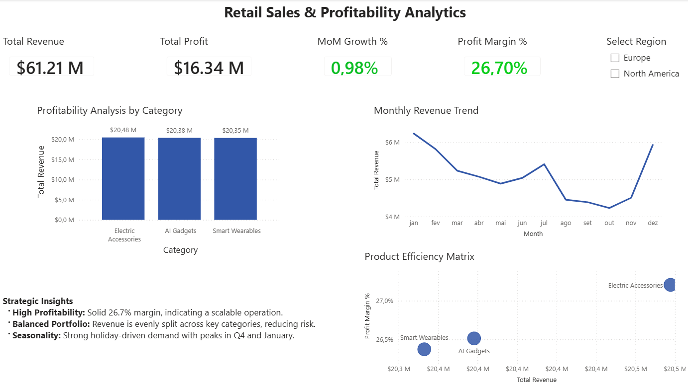
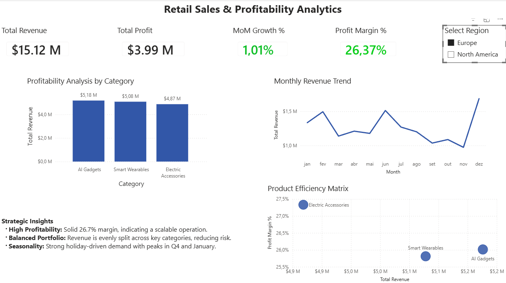

# 📊 Retail Sales & Profitability Analytics Dashboard

🔗 **GitHub Repository:**  
https://github.com/RuiCDev/salesmind-retail-sales-analytics

---

## 📌 Business Problem

Retail businesses need to continuously monitor sales performance, profitability, and product efficiency to make informed operational decisions.

Without a centralized analytics solution, it becomes difficult to:
- Identify top-performing products  
- Track profitability across regions  
- Detect seasonal trends  
- Optimize pricing and inventory strategies  

---

## 🎯 Objective

Develop a Business Intelligence solution to:

- Monitor revenue and profit performance  
- Analyze product and category efficiency  
- Identify seasonal trends and demand patterns  
- Support data-driven operational and strategic decisions  

---

## 🧠 Solution Overview

This project delivers an end-to-end BI solution using **MySQL and Power BI**, transforming raw retail data into actionable business insights.

Key components:

- Data cleaning and transformation in MySQL  
- Star Schema data modeling for scalable analytics  
- Interactive Power BI dashboards for business users  

---

## 🏗️ Data Architecture

A **Star Schema** was implemented to ensure performance and scalability.

---

## 🛠️ Tech Stack

- MySQL (data cleaning, transformation, modeling)  
- Power BI (data visualization, dashboards)  
- DAX (KPI calculations and analysis)  
- Dimensional Modeling (Star Schema)  

---

## 📈 Dashboard Overview

This dashboard enables stakeholders to monitor business performance and quickly identify opportunities and risks.

### Key KPIs:
- Total Revenue  
- Total Profit  
- Profit Margin  
- Sales Trends Over Time  

### Key Visuals:
- Revenue by Product Category  
- Profitability Analysis  
- Regional Performance  
- Monthly Sales Trends  

---

## 💡 Key Business Insights

- **Strong Profitability:**  
  Generated **$61.21M revenue** and **$16.34M profit**, with a **26.7% margin**

- **Product Portfolio Balance:**  
  Revenue is distributed across categories, reducing dependency risk and improving stability  

- **Seasonality Patterns:**  
  Peak sales in **January and December**, supporting better campaign and inventory planning  

---

## 🎯 Business Impact

This solution enables:

- Better inventory and demand planning  
- More effective marketing timing based on seasonality  
- Improved pricing and margin control  
- Faster and more informed decision-making  

---

## 📸 Dashboard Preview

---

## 📂 Dataset

This project uses the [SalesMind 2026 Dataset](https://www.kaggle.com/datasets/algozee/dayaset-2020)

---

## 🚀 How to Run

1. Clone repository  
2. Run SQL scripts  
3. Open Power BI dashboard  

---